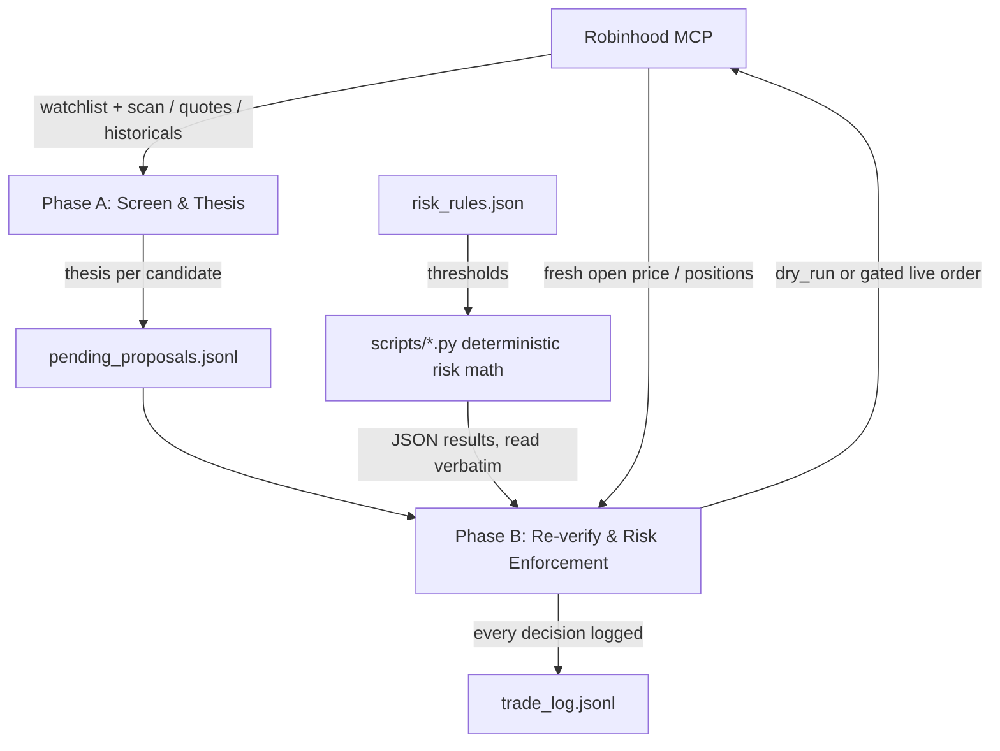

# agentic-trader

An agentic trading pipeline for [Robinhood](https://robinhood.com), driven by
two short scheduled Claude Code sessions a day. Phase A screens candidates and
writes a reasoned thesis for each; Phase B re-verifies those theses against
fresh opening data, enforces mechanical risk rules, and — only under a narrow,
explicit gate — places orders.

Adapted from **[FriesTrader](https://github.com/YizhiSong/FriesTrader)** by
Yizhi Song (MIT). The pipeline design, risk model, and task specs originate
there; see [NOTICE](NOTICE) for what's changed here.

> **Not financial advice.** This does not make LLM-driven stock picking more
> likely to beat an index fund, and the reasoning step cannot be honestly
> backtested — news-based reasoning can't be validated against historical data
> the model may already know the outcome of. The risk rules are the product
> here, not the stock picking. Running it against real money is your own
> decision and your own risk.

## The core idea

The LLM never does risk arithmetic. It gathers inputs and writes theses;
every number that decides whether an order happens — position size, stop
price, take-profit tier, loss limit, priority rank — is computed by a small
stdlib-only Python script in `scripts/`, and read back verbatim. Same inputs,
same numbers, every time. A persuasive thesis cannot cancel a stop-loss.



What actually stands between a thesis and an order:

- **Mechanical rules the model cannot override**, each computed by a script
  rather than by the model reasoning in prose.
- **New deployments start in `dry_run`** and stay there for at least
  `execution.dry_run_min_cycles_before_live` cycles.
- **Only a human flips `execution.mode` to `"live"`.** The agent is barred
  from changing it and refuses live orders while in `dry_run`.
- **Every decision is logged** to append-only `trade_log.jsonl`, approved or
  rejected, so the reasoning can be audited rather than trusted.

## Layout

| Path | What it is |
| --- | --- |
| `risk_rules.json` | Every hard limit, in one auditable file. Nothing may override these. |
| `scripts/` | The deterministic risk math. Stdlib-only, standalone, one JSON object out. |
| `tests/` | Test suite covering all five scripts through their real CLI contract. |
| `PHASE_A_TASK.md` | Full spec for the screening/thesis phase (Steps 1–3). |
| `PHASE_B_TASK.md` | Full spec for re-verification, risk enforcement, and execution (Steps 4–7). |
| `trade_log_template.jsonl` | The log line shapes each stage writes. |

The scripts:

| Script | Decides |
| --- | --- |
| `pnl_pct.py` | Daily/weekly loss-limit % against `starting_capital_usd`, and whether entries are halted. |
| `stop_loss.py` | Fixed or volatility-scaled `stop_pct`, the reference price (average cost, or trailing high once a tier has fired), and the trigger decision. |
| `take_profit.py` | Which tiers fire this cycle, cascading quantity correctly when one cycle's gain jumps past several unfired tiers. |
| `rank_candidates.py` | The priority order new entries and top-ups compete on. |
| `position_sizing.py` | Position/top-up sizing plus the concurrency and cash-buffer checks, compounding down the ranked list. |

Each takes plain CLI args and prints one JSON object. On failure they print
`{"error": "..."}` to stderr and exit 1 — never a traceback, because
`PHASE_B_TASK.md` treats any script failure as a halt condition and the halt
has to be machine-readable.

## Running the tests

```bash
pip install pytest
python -m pytest
```

The scripts themselves need nothing installed; pytest is a dev dependency
only. CI runs the suite on 3.9/3.11/3.13 and verifies `scripts/` stays
stdlib-only.

## First-time setup

1. Open a Robinhood
   [Agentic Trading](https://robinhood.com/us/en/agentic-trading/) account —
   it's separate from your regular investing account and restricted to the
   funds you put in it — and connect its MCP server to Claude Code. Every
   tool call in both task specs goes through it.
2. In `risk_rules.json`, fill in `account_number`, set
   `starting_capital_usd` to your real starting balance, set
   `universe.watchlist_name` to a watchlist you've already populated, and
   review **every** other threshold. The defaults are illustrative, not a
   recommendation.
3. Create a scan via the Robinhood MCP's `create_scan` tool (relative volume
   > 2.0x, market cap above your `min_market_cap_usd`) and paste its ID into
   `universe.supplementary_scan_id`. Left as the placeholder, that call fails
   every cycle.
4. Fill in `wash_sale_avoidance.linked_accounts` with every Robinhood account
   you personally control — the IRS wash-sale rule applies per taxpayer
   across all accounts, not per account.
5. **Leave `execution.mode` on `"dry_run"`.** Keep it there for at least
   `dry_run_min_cycles_before_live` cycles.
6. Read `trade_log.jsonl` yourself after each cycle — specifically the
   rejections and stop-loss triggers, not just the trades that worked. That's
   where you find out whether the reasoning is sound or just riding an uptrend.
7. Only flip `execution.mode` to `"live"` by hand, yourself, once you've seen
   enough dry-run cycles to trust it.

## Scheduling

Two schedules: Phase A around 4:30pm Central on weekdays (a full trading day's
close feeds the thesis), Phase B around 8:35am Central (5 minutes after the
open, so the order uses a fresh price rather than a stale overnight one).

Each run is a fresh Claude Code session pointed at this repo — the repo is the
persistent state, not local disk, so runs clone fresh and commit results back.
Claude Code's scheduled cloud routines are the intended host; a local
scheduler works too, but only fires while that machine is on, and you own
keeping the repo synced. Only one scheduler should ever be active per phase —
two firing the same cycle risks duplicate log entries, or duplicate real
orders once live.

See FriesTrader's README for the routine prompt templates each phase expects.

## Known limitations

Carried over by design, and worth deciding on before going live:

- **Loss limits see only *realized* P&L.** `pnl_pct.py` measures closed-trade
  returns against starting capital, so a portfolio deep in *unrealized*
  drawdown never halts entries. Per-position stops are the only thing
  covering that today.
- **Sizing rejects rather than clips.** A candidate that would breach the cash
  buffer at its full conviction size is rejected outright, even when a
  smaller position would have cleared it.
- **The LLM parses `trade_log.jsonl` itself** each cycle — for idempotency,
  dry-run cycle counts, fired tiers, and sell re-entry locks. All of that is
  mechanical bookkeeping that belongs in code, and the log grows unbounded
  while being read whole every run.
