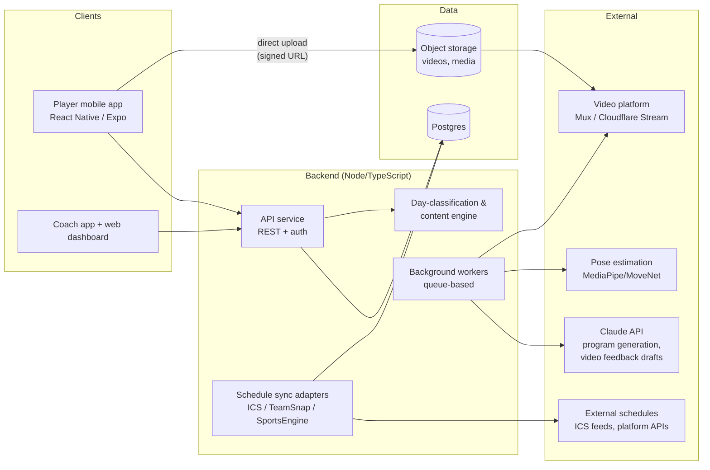
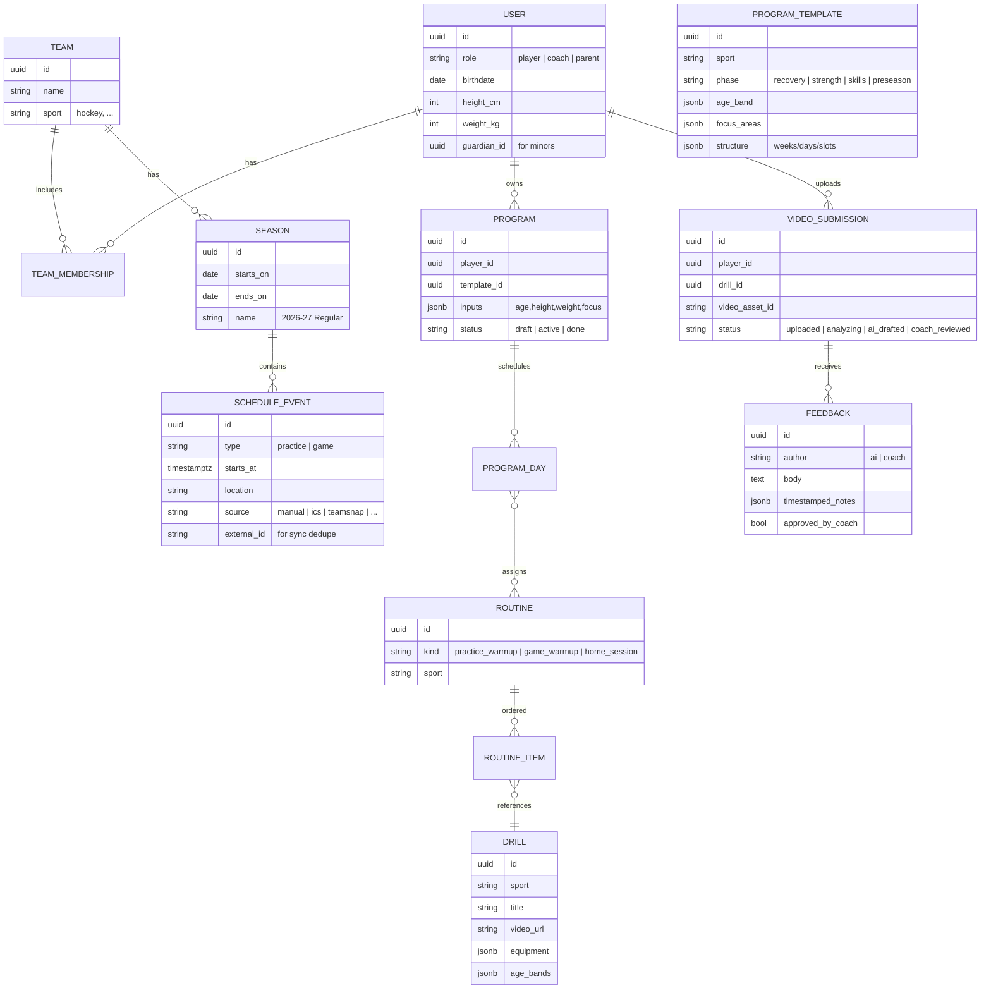
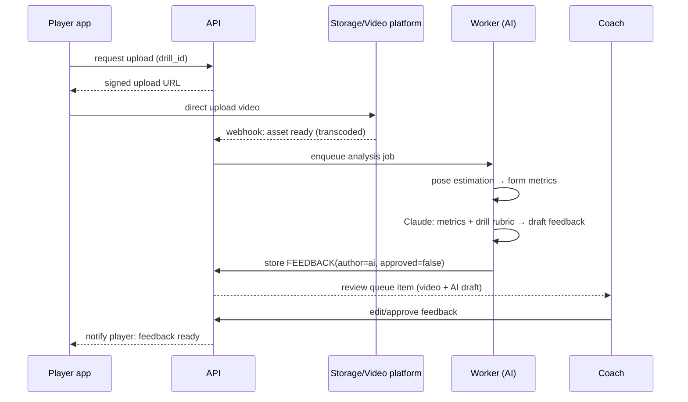

# Athlete Guide — Architecture

## 1. Product summary

Athlete Guide is a mobile-first training companion for team-sport athletes (hockey first). Its core idea is **day-aware guidance**: the app classifies every calendar day for each athlete and serves the right content for that day.

```
                         ┌─────────────────────────────┐
                         │        Season window        │
            ┌────────────┤  (start date … end date)    ├────────────┐
            │ in-season  └─────────────────────────────┘ off-season │
            ▼                                                       ▼
  ┌───────────────────┐                                  ┌──────────────────────┐
  │ GAME DAY          │→ game-day warm-up routine        │ Personalized          │
  │ PRACTICE DAY      │→ practice warm-up routine        │ periodized program:   │
  │ OFF DAY           │→ in-home practice & exercise     │ recovery → strength → │
  └───────────────────┘   guide (+ video upload)         │ skills → pre-season   │
                                                         └──────────────────────┘
```

Two roles:

- **Player** — sees "Today" guidance, calendar, programs, uploads drill videos, receives feedback.
- **Coach** — manages team, season dates, practice/game schedules; reviews player videos (with AI-drafted feedback); monitors adherence.

A third role, **Parent/Guardian**, is planned early in the data model (most players will be minors — see §8).

---

## 2. System overview



### Recommended stack

| Layer | Choice | Rationale |
|---|---|---|
| Mobile | React Native + Expo (one app, role-based UI) | One codebase for iOS/Android; players are mobile-first; Expo speeds up video/camera work |
| Coach web | Next.js (shares TS types with API) | Coaches do schedule/roster admin better on a laptop; can wait until Phase 2 |
| API | Node/TypeScript (Fastify or NestJS) + Prisma | Shared types end-to-end; fast iteration |
| DB | Postgres | Relational fits teams/seasons/schedules; JSONB for program documents |
| Auth | Firebase Auth (verified as standard OIDC — provider-swappable) | Don't build auth; free to 50k MAU; FCM synergy for push later; parent-consent flows stay app-level |
| Storage/Video | S3-compatible storage + Mux or Cloudflare Stream | Direct-to-storage uploads, transcoding, HLS playback, thumbnails out of the box |
| Jobs | Redis-backed queue (BullMQ) | Video analysis and program generation are async, retryable jobs |
| AI | Claude API (guidance text, feedback drafts) + MediaPipe/MoveNet (pose metrics) | LLM for coaching language and personalization; pose model for objective form metrics |

> Faster-MVP alternative: Supabase (auth + Postgres + storage + row-level security) with a thin Node service just for sync adapters and AI jobs. Same data model either way; this trades some control for speed and is a reasonable Phase-1 shortcut.

---

## 3. Data model



Key modeling decisions:

- **Everything content-related is keyed by `sport`** (drills, routines, templates). Adding a second sport is a content exercise, not a schema change.
- **Schedule events carry `source` + `external_id`** so imported events can be re-synced idempotently and manual edits don't get clobbered.
- **Programs are structured JSON documents** (weeks → days → routine slots) generated from templates, so they render natively in the app and can be edited by a coach.
- **Feedback is dual-author**: AI drafts and coach notes are separate rows; only coach-approved feedback (or clearly-labeled AI suggestions, per team setting) is shown to the player.

---

## 4. Day classification — the core engine

Every player's "Today" view is driven by one pure function evaluated over their team's season and schedule:

```
classifyDay(player, date):
    season = activeSeason(player.team, date)
    if season is None or date outside season window  → OFF_SEASON
    events = eventsFor(player.team, date)
    if any event.type == "game"                      → GAME_DAY
    if any event.type == "practice"                  → PRACTICE_DAY
    else                                             → IN_SEASON_OFF_DAY
```

Content resolution per classification:

| Day type | Player sees |
|---|---|
| `GAME_DAY` | Game-day warm-up routine (+ game time/location, prep checklist) |
| `PRACTICE_DAY` | Practice warm-up routine (+ practice time/location) |
| `IN_SEASON_OFF_DAY` | In-home practice & exercise session (drill list, videos, upload CTA) |
| `OFF_SEASON` | Today's session from their active personalized program |

This function is deterministic and cheap — computed on read, cached per (player, date). It also drives push notifications ("Game tonight — here's your warm-up").

---

## 5. Scheduling & external platform integration

Phased strategy, because "connect to other platforms?" was an open question in the notes:

1. **Manual entry** (MVP) — coach creates practice/game events, with weekly recurrence for practices.
2. **ICS feed import** (MVP) — nearly every team platform (TeamSnap, SportsEngine, Spond, BenchApp) exposes an iCalendar subscription URL. One ICS adapter covers all of them: poll the feed, upsert `SCHEDULE_EVENT` rows by `external_id`, classify game vs. practice by keyword heuristics with a coach-confirm step.
3. **Native API adapters** (later) — TeamSnap has a public API; add per-platform adapters behind a common `ScheduleSource` interface only when user demand justifies each one.

The adapter interface stays the same across all three: `fetchEvents(source) → upsert(events)` on a schedule (worker job), never blocking user requests.

---

## 6. Video upload, coach review, and AI guidance



Design points:

- **Direct-to-storage uploads** via signed URLs — video never flows through the API service. The video platform handles transcode/HLS/thumbnails.
- **AI is coach-in-the-loop by default.** The AI produces a draft (structured: what looks good / what to fix / one focus cue) from pose metrics plus a per-drill rubric. The coach approves or edits before the player sees it. Teams may enable instant "AI suggestions" delivery, clearly labeled, for drills where the coach opts in.
- **Per-drill rubrics** (e.g., stickhandling: head up, knee bend, top-hand control) live with the drill content and anchor the AI feedback so it stays concrete and consistent.

## 7. Off-season program generation

Inputs: sport, age, height, weight, focus areas (e.g., skating speed, shot power, conditioning), season dates (so the program lands exactly in the off-season window), and available equipment.

Generation is **template-constrained, not free-form**:

1. Select a periodized `PROGRAM_TEMPLATE` matching sport + age band + focus areas (phases: recovery → general strength → sport skills → pre-season ramp, apportioned across the off-season length).
2. Claude customizes within the template's slots — exercise selection, progressions, weekly emphasis — while hard guardrails enforce age-appropriate rules (volume caps, no maximal loading for younger age bands, mandatory rest days).
3. Output is validated against a JSON schema, stored as a `PROGRAM`, and reviewable/editable by the coach before or after activation.

This keeps the "end-to-end guidance" personalized while guaranteeing every generated plan stays inside sports-science-vetted boundaries.

As built (`apps/api/src/programs/`): `skeleton.ts` owns the periodized frame (phase dates, training weekdays, Sundays always rest), `guardrails.ts` owns the age bands and validates every finished plan, and `generate.ts` fills the frame — Claude via structured outputs when credentials are configured, a deterministic exercise catalog otherwise or whenever the AI's plan fails validation. `POST /me/program` therefore always yields a valid plan, and `GET /me/today` serves the right session (or rest day) for every off-season date. Coaches get read-only visibility via `GET /teams/:teamId/programs` — each roster player's current phase, today's session, and phase timeline — surfaced as a card in the Coach tab; coach editing of plans is still open.

---

## 8. Security, privacy, and youth safety

This app will have many users under 13, which drives real architectural requirements — not afterthoughts:

- **Parental consent flow** (COPPA/GDPR-K): minors' accounts are created or approved by a guardian; guardian email is captured at signup.

  As built: guardians create child profiles (`POST /me/children`) that carry a birthdate, no credentials, and a non-routable synthetic email — children cannot sign in. The guardian's device acts for a child by sending `x-child-id` on player-centric routes (`requireActor` verifies guardianship on every request); guardianship actions themselves — creating profiles, `PUT /me/children/:id/consent` — always require the guardian's own identity, so an acted-as child can never grant its own consent. The consent flag gates `POST /submissions` for under-13s (calendar-age check in `src/domain/age.ts`).

- **Video visibility is minimal by default**: a player's video is visible only to that player, their guardian, and their team's coaches. No public content, no cross-team access. Enforced at the query layer (or RLS if on Supabase).
- **Data retention**: videos auto-expire after a configurable window (e.g., 90 days post-review); account deletion cascades to media.
- **AI safety posture**: AI feedback is coach-moderated by default (§6); generation guardrails for youth training loads (§7); no AI interaction is a free-form chat with a minor.
- Standard baseline: TLS everywhere, signed URLs with short TTLs, role-based authorization on every endpoint, audit log on coach access to player media.

## 9. Cross-cutting concerns

- **Offline-first for training content**: today's routine and its drill videos are prefetched and cached on-device — home workouts happen in basements and garages with bad Wi-Fi. Uploads queue and retry.
- **Notifications**: day-classification drives them (morning "here's today", pre-game warm-up reminder, "coach reviewed your video").
- **Content pipeline**: drills/routines/templates are data, managed via an admin interface (can start as seed files in the repo). Hockey content is the launch investment; the schema already supports more sports.
- **Analytics**: adherence (sessions completed), upload/review turnaround, day-type engagement — these are also the coach dashboard's raw material.
